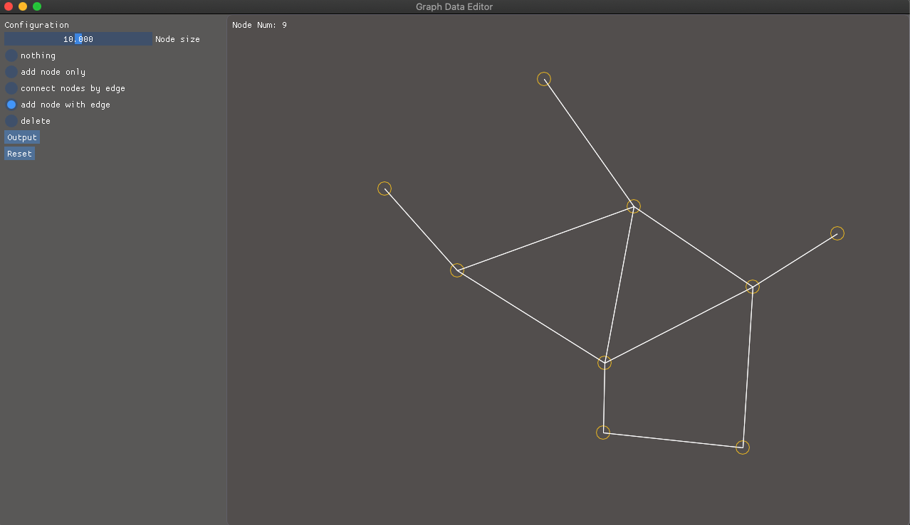

# Graph Data Editor

## build & run

```
$ mkdir build
$ cd build
$ cmake ..
$ make
$ ./graphDataEditor [img_file]
```



Images can be set as a base.


## export data format

`yyyymmdd_hhmmss.nod`
```
node num
node_id_0, x_0, y_0
node_id_1, x_1, y_1
node_id_2, x_2, y_2
:
:
edge num
edge_id_0, node_id_0, node_id_1
edge_id_1, node_id_0, node_id_3
:
:
```
